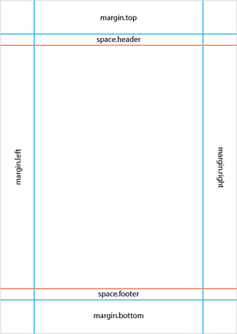

<p align="center">
	
</p>

<p align="center">
	<a href="https://github.com/Carthage/Carthage">
		
	</a>
	
	
	<a href="http://cocoapods.org/pods/TPPDF">
		
	</a>
	<a href="http://cocoapods.org/pods/TPPDF">
		
	</a>
</p>

<p align="center">
	<a href="https://travis-ci.org/techprimate/TPPDF">
		
	</a>
	<a href="https://app.codacy.com/app/techprimate/TPPDF">
		
	</a>
	<a href="https://codebeat.co/projects/github-com-techprimate-tppdf-master">
		
	</a>
	<a href="https://bettercodehub.com/results/Techprimate/TPPDF">
		
	</a>
	<a href="https://codecov.io/gh/techprimate/TPPDF">
		
	</a>
</p>

<p align="center">
	<b>
	TPPDF is a fast PDF builder for iOS using simple commands to create advanced documents!
	</b>
</p>

<p align="center">
    <a href="#features">Features</a>
  • <a href="#communication">Communication</a>
  • <a href="#usage">Example</a>
  • <a href="#usage">Usage</a>
  • <a href="#installation">Installation</a>
  • <a href="#credits">Credits</a>
  • <a href="#license">License</a>
</p>

## Features

- Page header and footer
- Dynamic content layout with page alignment
- Support for tables and cell alignment
- Attributed strings
- Custom spacing
- Image support
- Horizontal line separators
- Custom indentation
- Custom top offset (good for layered rendering)
- Pagination
- Image caption
- Compress images
- Custom image size fit
- Image in the header and footer
- Horizontal line separators in the header and footer
- Generate PDF files directly to handle large PDF files ([Details](http://stackoverflow.com/questions/14691264/how-can-i-lower-memory-climb-when-generating-large-pdfs))
- PDF metadata
- Custom table styling
- Multi-column sections
- You need more features? Checkout #Contribute

## Communication

- If you **need help**, use [Stack Overflow](http://stackoverflow.com/questions/tagged/tppdf). (Tag 'TPPDF')
- If you'd like to **ask a general question**, use [Stack Overflow](http://stackoverflow.com/questions/tagged/tppdf).
- If you **found a bug**, open an issue.
- If you **have a feature request**, open an issue.
- If you **want to contribute**, submit a pull request.

## Example

To run the example project, run `pod try TPPDF`

## Usage

Building a PDF document is very easy:

First, you create a document with a paperformat...

```swift
let document = PDFDocument(format: .a4)
```

...then you add your information to a container...

```swift
document.addText(.contentCenter, text: "Create PDF documents easily.")
```

...then you render the document...
 
```swift 
PDFGenerator.generateURL(document: document, filename: "Example.pdf")
```

**...done!**

If you need more details, start here:

### Document creation

You can create a document using a predefined `PDFPageFormat` or by creating a custom `PDFPageLayout`:

```swift
let layout = PDFPageLayout()
let document = PDFDocument(layout: layout)
```
```swift
let document = PDFDocument(format: PDFPageFormat.a4)
```

### Page Layout

The following values can be set to format the page:

- `size` --- width and height of a page
- `margin` --- content inset on each side of a page
- `space.header` --- Space between header and content elements
- `space.footer` --- Space between footer and content elements

All values are in dots and are rendered using 72 DPI (dots per inch), as this is the default screen DPI.

You can also used the predefined formats. For details please refer to the source file [PDFPageFormat.swift](https://github.com/techprimate/TPPDF/blob/master/Source/PDFPageFormat.swift)

If you need your page in landscape format, use the `landscapeSize` variable.



### Elements

TPPDF is element based. When adding any content to the document, you are actually adding an element. Then at the render process all elements are calculated and rendered. But first you need to understand the concept of the layout engine:

### Container

Every element is placed in a specific container. Three containers exist: Header, Content, Footer. Additionally every container has an alignment: Left, Center, Right.

When you add an new element, you need to provide the correct container - the default container is `ContentLeft`, therefore it is an optional parameter. During calculation it will place the element in the correct container and calculate the correct frame accordingly.

A good example would be the following:

```swift
let document = PDFDocument(format: .a4)
document.add(.footerCenter, text: "Created using TPPDF for iOS.")
```

This command adds the text **Created using TPPDF for iOS** to the footer of all pages, because elements in the header and footer containers are placed on every page.

### Header & Footer

Basically all elements which are either to either a header (`headerLeft`, `headerCenter` or `headerRight`) or footer (`footerLeft`, `footerCenter` or `footerRight`) container, are considered as header and footer elements and will be repeated on each page.

If a page does not have any content, e.g. an empty page in between two pages, the header and footer elements won't be added to this page neither.

### List of element types

... now let's continue with the different kinds of elements.

#### Line Separator

```swift
let style = PDFLineStyle(type: .full, color: UIColor.darkGray, width: 0.5)
document.addLineSeparator(PDFContainer.contentLeft, style: style) 
```

Adds a horizontal line with a specific `style` in the given `container`. This line is affected by the `indentation`, therefore it is possible to change its width by setting a left and a right indentation before. See [Line Style](#LineStyle) for details about the line styling.

#### Simple Text

To add a simple string `text` with a custom `lineSpacing`, you first need to create a `PDFSimpleText` and the an add it to the document.

```swift
let text = "Some text!"
let spacing: CGFloat = 10.0
let textElement = PDFSimpleText(text: text, spacing: spacing)
document.add(textObject: textElement)
```

For convenience you are also able to add an attributed string directly, and TPPDF will wrap it in a `PDFSimpleText` for you.

```swift
document.add(text: text, lineSpacing: spacing)
```

During the render process it will create an attributed string using the font set by `setFont(font:)` and the text color set by `setTextColor(color:)`. 

#### Attributed Text

To add an attributed string to the document, you first need to create a `PDFAttributedText` and then add it to the document.

```swift
let attributedTitle = NSMutableAttributedString(string: "Awesome attributed title!", attributes: [
	NSFontAttributeName : UIFont.systemFontOfSize(28.0),
	NSForegroundColorAttributeName : UIColor(red: 219.0 / 255.0, green: 100.0 / 255.0, blue: 58.0 / 255.0, alpha: 1.0)
])
let textElement = PDFAttributedText(text: title)
document.add(attributedTextObject: attributedTitle)
```

For convenience you are also able to add an attributed string directly, and TPPDF will wrap it in a `PDFAttributedText` for you.

```swift
document.add(attributedText: attributedTitle)
```

#### Image

To add an image to the document, you first need to create a `PDFImage` which wraps the image and the customization.

```swift
let image = UIImage(named: "awesome-image")!
let imageElement = PDFImage(image: image)
document.add(image: imageElement)
```

A `PDFImage` can also include a optional `caption` which is either a `PDFSimpleText` or `PDFAttributedText`. 
The caption is underneath the image and has the image width as the maximum available width.
All image settings are customizable per image-object.

If you set a `size` it will try to fit in this size, defaults to `CGSize.zero` which will then use the actual image pixel size. The image can either be scaled to fit the `width` the `height` or both. Adjust this by setting the `sizeFit` on of:
 
- `PDFImageSizeFit.width`
- `PDFImageSizeFit.height`
- `PDFImageSizeFit.widthHeight`

To optimize file size, images are resized and compressed using JPEG compression. By default both is enabled, but can change them by setting `options` on the image instance.

If resizing is enabled, the image will be resized to its frame size in the document.
If compression is enabled, the image will be compressed using the value set in the property `quality`. This value ranges from between `0.0` for bad quality and `1.0` for best quality - default is set to `0.85`, which resolves in a good balance between compression and quality.

##### Round Corners

To enable rounded corners, simple add `.roundedTopLeft`, `.roundedTopRight`, `.roundedBottomRight` or `.roundedBottomLeft` for their respective corner to the `options` field or `.rounded` as a shorthand for all corners.

The default value for the `cornerRadius` is set to `nil`, is uses half the image frame size radius. If a custom value is set, it will be in aspect to the final frame.

**Example:**

The  image `Icon.png` has the size `1024px x 1024px` and will be drawn in a frame of `150pt x 150pt`.
The corner radius is set to `15pt`, therefore the image will first be clipped with a `1024 / 150 * 25 = 170pt` radius and then drawn in the frame, resulting in the given corner radius.

```swift
PDFImage(image: UIImage(named: "Icon.png")!,
         size: CGSize(width: 150, height: 150),
         options: [.rounded],
         cornerRadius: 25)
```

#### Images in one row

To create a image collage, you can add multiple images in a single row with a `spacing` between them.

Just create an array of `PDFImage` and add them as images in a row. 

```swift
let images = [
    PDFImage(image: UIImage(named: "Image-1.jpg")!, 
             caption: PDFAttributedText(text: NSAttributedString(string: "In this picture you can see a beautiful waterfall!", attributes: captionAttributes))),
    PDFImage(image: UIImage(named: "Image-2.jpg")!,
             caption: PDFAttributedText(text: NSAttributedString(string: "Forrest", attributes: captionAttributes))),
]

document.add(imagesInRow: images, spacing: 10)
```

#### List

Create a `PDFList` element with the indentation of each level. Each indentation level consists out of a pair of values, `pre` setting the indentation before the list symbol and `past` setting the distance between the symbol and the text.

If you do not provide enough indentation levels, e.g. you only define three but you add an element at the fourth level, the default value `0` will be used for `pre` and `past`.

```swift
let list = PDFList(indentations: [(pre: 0.0, past: 20.0), (pre: 20.0, past: 20.0), (pre: 40.0, past: 20.0)])
```

A list item consists out of a `symbol` and an optional `content`. The symbol is one of the following:

- `PDFListItemSymbol.none`

Doesn't display a symbol before the content

- `PDFListItemSymbol.inherit`

If an item is nested and uses this symbol, it will take the same one as the parent.

- `PDFListItemSymbol.dot`

Symbol is a middle-dot.

- `PDFListItemSymbol.dash`

Symbol is a dash/minus.

- `PDFListItemSymbol.custom(value: String)`

You need to provide any string `value` which will then be used as the symbol. Be sure to set the indentation value correctly, as the indentation is not based on the symbol frame width.

- `PDFListItemSymbol.numbered(value: String?)`

When the parent of multiple list items is of type `numbered` then it will use the index as the symbol, starting with `1` and append a dot `.` to the number.
If you provide `value` this will be used for the parent item, in case you want to override the value.

**Nested Lists**

By adding a list item to another list item you can create nested lists:

```swift
list.addItem(PDFListItem(symbol: .numbered(value: nil))
        .addItem(PDFListItem(content: "Introduction")
            .addItem(PDFListItem(symbol: .numbered(value: nil))
                .addItem(PDFListItem(content: "Text"))
                .addItem(PDFListItem(content: "Attributed Text"))
            ))
        .addItem(PDFListItem(content: "Usage")))
```

Now you have created a multi-level list element, you can add to the document:

```swift
document.add(list: list)
```

#### Table

Create a `PDFTable` element, which will now be customized.

```swift
let table = PDFTable()
```

Each cell has an optional `content` of type `PDFTableContent`, an optional `style` of `PDFTableCellStyle` and always an `alignment` of `PDFTableCellAlignment`.

##### Alignment

The alignment is one of the following `PDFTableCellAlignment`:

- `topLeft`, `top`, `topRight`
- `left`, `center`, `right`
- `bottomLeft`, `bottom`, `bottomRight`

During calculation the size of the content will be calculated, and afterwards it will be positioned using the cell alignment.

##### Content

A cell content instance `PDFTableCellContent` has a `content` value and a property `type`, which is one of the following:

- `PDFTableContent.none`, empty cell
- `PDFTableContent.string`, a simple string only styled through the cell style
- `PDFTableContent.attributedString`, an attributed string which won't be changed by the cell style
- `PDFTableContent.image`, an image which 

If a cell height is too big for the rest of the page, it will be placed on the next page.

##### Cell Style

To define the style of a cell, you can create the an instance of `PDFTableCellStyle` and directly set it to the cells `style` property, but you can also style a whole table using the property `style` of type `PDFTableStyle` of the `table`.

A cell style defines the `fill` and the `text` color of the content. Also it defines how the `border` is drawn and what `font` should be used:

```swift
let colors = (fill: UIColor.blue, text: UIColor.orange)
let lineStyle = PDFLineStyle(type: .dashed, color: UIColor.gray, width: 10)
let borders = PDFTableCellBorders(left: lineStyle, top: lineStyle, right: lineStyle, bottom: lineStyle)
let font = UIFont.systemFont(ofSize: 20)
let style = PDFTableCellStyle(colors: colors, borders: borders, font: font)
```

An instance of `PDFTableCellBorders` allows you set each border of a cell indvidually. The line style is defined as a `PDFLineStyle` (See [Line Style](#Line-Style)).

To change the style of a specific cell, use the following method of `table`:

```swift
do {
    try table.setCellStyle(row: 1, column: 1, style: PDFTableCellStyle(colors: (fill: UIColor.yellow, text: UIColor.black)))
} catch PDFError.tableIndexOutOfBounds(let index, let length){
    // In case the index is out of bounds

    print("Requested cell is out of bounds! \(index) / \(length)")
} catch {
    // General error handling in case something goes wrong.

    print("Error while setting cell style: " + error.localizedDescription)
}
```

##### Table style

A table style is a collection of cell styles, which will be applied as global values. Take a look at `PDFTableStyleDefaults` where you can find a collection of presets, e.g. `PDFTableStyleDefaults.simple`.

Using the table style you can define the `outline` line style. This will be drawn around the table on each page.

A `PDFTableStyle` lets you set how many rows and columns are considered header cells, and how many rows should be styled as footer rows:

```swift
let style = PDFTableStyle()
style.rowHeaderCount = 3
style.columnHeaderCount = 5
style.footerCount = 1
```

Now the top five rows will be styled using the `style.columnHeaderStyle`, the first three columns will be styled using the `style.rowHeaderStyle` and the very last row will be styled using the `style.footerStyle`.

All other cells are styled using the `style.contentStyle` and if the optional value `style.alternatingContentStyle` is set, then every other row will use this style.

If there are conflicts, e.g a cell is a column and a header row, then the following priority order, with the higher ones beating the lower ones, is used:

- `style.outline` can receive a `PDFLineStyle` to draw table borders. PDFLineStyle can take radius `CGFloat?` propriety to define radius border. This proprity is only used when drawing a rect, like table. 
- `cell.style`, a custom style set for this particular cell
- `style.columnHeaderStyle`, if the cell is a column header therefore in the top rows
- `style.footerStyle`, if the cell is a footer row
- `style.rowHeaderStyle`, if the cell is in the one of the first columns
- `style.alternatingContentStyle`, if the cell is has an odd row index
- `style.contentStyle`, the style every normal cell has

If you set the property `table.showHeadersOnEveryPage` to `true`, the first rows which are the column headers, will be copied and inserted at the top of the table, after each page break.

##### Table generation

First, add your cell data and set the alignment for each cell. This needs to be wrapped in a `try-catch` because it can fail with invalid data or if the validation fails.

The quickest way to generate a new table is using `generateCells(data:, alignments:)`. You need to pass two two-dimensional arrays, one with the data which can be `nil`, `String`, `NSAttributedString`, `Int`, `Double`, `Float` or an `UIImage`. Numbers will be converted into simple strings. Any other content will throw a `PDFError.tableContentInvalid`:

```swift
do {
    try table.generateCells(data: [
        [nil, "Name", "Image", "Description"],
        [1, "Waterfall", UIImage(named: "Image-1.jpg")!, "Water flowing down stones."],
        [2, "Forrest", UIImage(named: "Image-2.jpg")!, "Sunlight shining through the leafs."],
        [3, "Fireworks", UIImage(named: "Image-3.jpg")!, "Fireworks exploding into 100.000 stars"],
        [4, "Fields", UIImage(named: "Image-4.jpg")!, "Crops growing big and providing food."],
        [1, "Waterfall", UIImage(named: "Image-1.jpg")!, "Water flowing down stones."],
        [2, "Forrest", UIImage(named: "Image-2.jpg")!, "Sunlight shining through the leafs."],
        [3, "Fireworks", UIImage(named: "Image-3.jpg")!, "Fireworks exploding into 100.000 stars"],
        [4, "Fields", UIImage(named: "Image-4.jpg")!, "Crops growing big and providing food."],
        [nil, nil, nil, "Many beautiful places"]
    ],
    alignments: [
        [.center, .left, .center, .right],
        [.center, .left, .center, .right],
        [.center, .left, .center, .right],
        [.center, .left, .center, .right],
        [.center, .left, .center, .right],
        [.center, .left, .center, .right],
        [.center, .left, .center, .right],
        [.center, .left, .center, .right],
        [.center, .left, .center, .right],
        [.center, .left, .center, .right],
    ])
} catch PDFError.tableContentInvalid(let value) {
    // In case invalid input is provided, this error will be thrown.

    print("This type of object is not supported as table content: " + String(describing: (type(of: value))))
} catch {
    // General error handling in case something goes wrong.

    print("Error while creating table: " + error.localizedDescription)
}
```

You are also able to create each cell individually, put them in a two-dimensional cell array and assign it to `table.cells` directly. The method above is simply added for convenience.

##### Layout

The table height is defined by its content, but the width is the available space between the indentations.
The width of each column is set by a relative width, defined in an array of values between `0.0` and `1.0` which should sum up to `1.0` being `100%` of the width.

```swift
table.widths = [0.1, 0.3, 0.4, 0.2]
```

Also each cell can have a `margin` which is the distance between the cell frame and its inner borders and the `padding` as the distance between the inner borders and the content.


...and finally you add the table to the document:

```swift
document.add(table: table)
```

#### Multi-Column Sections

A multi-column section is a nested container. You create the section with an amount of columns and their relative width, add objects to each column and then add the whole section to the document. 

When adding an object to the section column, you use the Array subscript `section.columns[0]`. You are able to give it an alignment as the first parameter, similar to the `PDFContainer` but only with `.left`, `.center` and `.right` as it is not possible to add a section to the header or footer containers.

```swift
let section = PDFSection(columnWidths: [0.3, 0.4, 0.3])
section.columns[0].addText(.right, text: "right")
section.columns[1].addText(.left, text: "left")
section.columns[2].addText(.center, text: "center")
document.add(sectiion: section)
```

#### Column Wrap Sections

A column wrap section allows you to split your page into multiple columns and fill it up starting at the left. All you have to do is enable it, add content, and then disable it. When disabling it you can set the flag `addPageBreak` if you want it to continue on a fresh page (defaults to true).

```swift
document.enable(columns: 4, widths: [0.2, 0.3, 0.4, 0.1], spacings: [10, 50, 20]);
for i in 0..<200 { // This is an example for the content
    document.add(text: "\(i)-A-B-C-D-E-F-G-H-I-J-K-L-M-N-O-P-Q-R")
}
document.disableColumns(addPageBreak: false);
```


#### Groups

Groups give you the option to dynamically add elements to your document, but calculate them as one.
This way it is possible to add e.g. multiple `PDFText` elements and if the calculations require a page break, it can be disabled. 

Additionally groups allow to set either an `UIColor` as the `backgroundColor` or even create a complex `PDFDynamicGeometryShape` which adapts to the group frame (see [Dynamic Geometry Shapes](#Dynamic-Geometry-Shapes) for more details). You are also able to add a padding to the group to add additional space around the content.

**Example:**

```swift
let shape = PDFDynamicGeometryShape(...)
let group = PDFGroup(allowsBreaks: false,
                     backgroundColor: .green,
                     backgroundShape: shape,
                     padding: UIEdgeInsets(top: 50, left: 50, bottom: 50, right: 180))
for i in 0..<10 {
    group.set(font: UIFont.systemFont(ofSize: 25))
    group.set(indentation: 30 * CGFloat(i % 5), left: true)
    group.set(indentation: 30 * CGFloat(i % 3), left: false)
    group.add(text: "Text \(i)-\(i)-\(i)-\(i)-\(i)")
}
document.add(group: group)
```

#### Dynamic Geometry Shapes

Shapes are very closely related to simple geometric paths, but with the difference, that they adapt to frame changes dynamically.

A `PDFDynamicGeometryShape` holds three properties: 

- `PDFBezierPath` in `path`, defining how the shape looks like
- `UIColor` in `fillColor` for the content color 
- and a `PDFLineStyle` in `stroke` for the look of the lines

**Example:**

```swift
let shape = PDFDynamicGeometryShape(path: path, fillColor: .orange, stroke: .none)
```

`PDFBezierPath` is heavily related to `UIBezierPath` matching all its functions (e.g. `move(to:)`, `addLine(to:)`). The main difference is that all vertices are of type `PDFBezierPathVertex` and hold a reference to an anchor of the group frame. Using the reference frame of the path, it will resize the shape to fit the group frame, but the vertices will keep their position relative to their anchor.

The following example draws a diamond shape in a `100pt` square.

```swift
let size = CGSize(width: 100, height: 100)
let path = PDFBezierPath(ref: CGRect(origin: .zero, size: size))
path.move(to: PDFBezierPathVertex(position: CGPoint(x: size.width / 2, y: 0), 
                                  anchor: .topCenter))
path.addLine(to: PDFBezierPathVertex(position: CGPoint(x: size.width, y: size.height / 2),
                                     anchor: .middleRight))
path.addLine(to: PDFBezierPathVertex(position: CGPoint(x: size.width / 2, y: size.height),
                                     anchor: .bottomCenter))
path.addLine(to: PDFBezierPathVertex(position: CGPoint(x: 0, y: size.height / 2),
                                     anchor: .middleLeft))
path.close()
```

### Helpers

The following methods of `PDFDocument` are not considered as elements, as they are only runtime changes to the calculations and rendering.

#### Space - `add(_ container: PDFContainer, space: CGFloat)`

Adds a space with the height of `space` between the previous element and the next element.

```swift
document.set(space: 32.0)
```

#### Simple Text Font - `set(_ container: PDFContainer, font: UIFont)`

Sets the font of a container. This font will be used in all following elements of type `PDFSimpleText` in the given container, until the font is changed. This font does not affect `PDFAttributedText` elements.

```swift
document.set(font: UIFont.systemFont(ofSize: 20.0))
```

#### Reset Simple Text Font - `resetFont(_ container: PDFContainer)`

This resets the font to the default font, which is `UIFont.systemFont(ofSize: UIFont.systemFontSize)`

```swift
document.resetFont(.contentLeft)
```

#### Simple Text Color - `set(_ container: PDFContainer, textColor: UIColor)`

Sets the text color of a container. This text color will be used in the next commands in the given container, if there is not a different color specified.

```swift
document.set(textColor: UIColor.green)
```

#### Reset Simple Text Color - `resetTextColor(_ container: PDFContainer)`

This resets the text color to the default text color, which is `UIColor.black`

```swift
document.resetTextColor(.contentLeft)
```

#### `set(_ container: PDFContainer, indent: CGFloat, left: Bool)` 

Set the indentation to a given `indent` in the container. By setting `left` to `false` you will change the indentation from the right edge.

```swift
document.set(indent: 50.0, left: true)
document.set(indent: 50.0, left: false)
```

Now the document has an indentation of `50` points from left and right edge.
If you need to reset the indentation, call the function with `0.0` as parameter

```swift
document.set(indent: 0.0)
```

#### `set(_ container: PDFContainer, absoluteOffset: CGFloat)`

Sets the offset in points from the top edge of a `container` to the given parameter `offset`.

This is useful if you need to layer multiple elements above each other.

#### Page Break

Simply call `document.createNewPage()` and it will add a page break. The next element will be positioned on the next page.

### Styling objects

#### Line Style

A `PDFLineStyle` can have one a line `type`, a `color` and a `width`. The following types are currently impelemented:

- `PDFLineType.none`, invisible line
- `PDFLineType.full`, a full line
- `PFDLineType.dashed`, a dashed line with the dash length and spacing three times the line width
- `PDFLineType.dotted`, a dotted line with the spacing two times the line width

### Pagination

To customize pagination, create an instance of `PDFPagination` and set it to the `pagination` property of your document or simply edit the default one.

Pagination needs one container where it will add the pagination elements on each page. This defaults to `.none` which results in no pagination added.

It is possible to set pagination `range` with a `start` and `end` index. You can also hide specific pages, by adding the page nunber to the `hiddenPages` property. The range is set default to include all pages.
As an example this won't paginate page `1`, `2`, `5` nor any page above `7`:

```swift
let pagination = PDFPagination()
pagination.range = (start: 3, end: 7)
pagination.hiddenPages = [5]
```

To actually define the `style` of the pagination, you can either choose on of the predefined ones, or create a custom closure-based style. The pagination algorithm receives the `current` page number and the `total` pages amount and returns a String, which will then be transformed into an attributed text element, using the attributes in the `textAttributes` dictionary.

#### `.default`

This is the default pagination setting, converts page `1` of `3` to `1 - 3`

#### `.roman(template: String)`

Page `8` of `13` will be converted into roman numerals `VIII` and `XIII` and inserted in the format, e.g `%@ _|_ %@` becomes `VIII _|_ XIII`. The main idea of this preset is converting the numbers into roman numerals but configure the text using the format.

#### `.customNumberFormat(let template, numberFormatter: NumberFormatter)`

Both numbers are converted into a string using the provided `numberFormatter`. This allows you to use the full capabilities of the built-in formatter class. Afterwards both values are also inserted into the provided `template`.

Example:

```swift
let formatter = NumberFormatter.init()
formatter.alwaysShowsDecimalSeparator = true
formatter.numberStyle = .currency
formatter.currencyCode = "EUR"

let template = "%@ + %@"
```

Page `8` of `13` will return the following: `€8.00 + €13.00` which might be completly unsuitable as a pagination, but displays the possibilities. :) 

#### `customClosure(closure: (_ page: Int, _ total: Int) -> String)`

The `closure` will be called everytime the generator needs the pagination value. You have full control on how the resulting string will look like.

Example:

```swift
PDFPaginationStyle.customClosure({ (page, total) -> String in
	let separator: String = {
		switch page % 4 {
			case 1:
				return "#"
			case 2:
				return "&"
			case 3:
				return "*"
			default:
				return "-"
		}
	}()
	return "\(page) " + separator + " \(total)"
})
```

This example will return a different separator, depending on the modulo result.

#### MORE!

If you want a specific style to be included in the presets, please open an issue! The more presets can be provided the better for everyone!

### Document Info

To store metadata information in the document, change the values of the `info` property.
You are able to set a `title`, `author`, `subject` and `keywords`.

If you need to encrypt the document, set an `owner password` and a `user password`. Also you can restrict printing and copying by setting the `allows printing` and `allows copying` flags.

### Generation

You can generate the PDF file using the following method:

```swift
let document: PDFDocument
let filename = "awesome.pdf"

let url = try PDFGenerator.generateURL(document: document, filename: String, progress: { progress in
    print(progress)
}, debug: false)
```

This will render the document to a temporary file and return the URL. Be sure to wrap it a `try-catch` block, as it might throw an error!

It is also possible to render the file and return the data, using `generateData`:

```swift
let document: PDFDocument
let filename = "awesome.pdf"

let data = try PDFGenerator.generateData(document: document, progress: { progress in
    print(progress)
}, debug: false)
```

And if you want to directly save it to a specific file, pass an URL to `generate(document:, to: )`:

```swift
let document: PDFDocument
let url = URL(string: "file://~/Desktop/awesome.pdf")!

try PDFGenerator.generate(document: document, to: url, progress: { progress in
    print(progress)
}, debug: false)
```

#### Multiple Documents

If you want to combine multiple `PDFDocument` into a single PDF file, use the alternative methods to the ones in the previous section, taking multiple `documents` as a parameter. 

The progress will now return three values: 

 - the current document index
 - the progress of the current document 
 - sum of total progress

**Example:**

```swift
let url = try PDFGenerator.generateURL(documents: [
	document1, document2
], filename: "Example.pdf", progress: { (docIndex: Int, progressValue: CGFloat, totalProgressValue: CGFloat) in
    print("doc:", docIndex, "progress:", progressValue, "total:", totalProgressValue)
})
```

#### Debug

If you want to enable a debug overlay, set the flag `debug` in `PDFGenerator.generate(..)`, `PDFGenerator.generateURL(..)` or `PDFGenerator.generateData(..)` to `true` and it will add colored outlines of the elements in you document.

## Installation

### Requirements

| Language  | Branch                                                           | Pod version | Xcode version         | iOS version |
| --------- | ---------------------------------------------------------------- | ----------- | --------------------- | ----------- |
| Swift 5   | [master](https://github.com/techprimate/TPPDF/tree/master)       | >= 1.4.x    | Xcode 10.2+           | iOS 8.3+    |
| Swift 4.2 | [swift-4.2](https://github.com/techprimate/TPPDF/tree/swift-4.2) | >= 1.3.x    | Xcode 10.0+           | iOS 8.3+    |
| Swift 4.1 | [swift-4.1](https://github.com/techprimate/TPPDF/tree/swift-4.1) | >= 1.0.x    | Xcode 9.3             | iOS 8.3+    |
| Swift 3.0 | [swift-3.0](https://github.com/techprimate/TPPDF/tree/swift-3.0) | >= 0.2.x    | Xcode 8               | iOS 8.0+    |
| Swift 2.3 | [swift-2.3](https://github.com/techprimate/TPPDF/tree/swift-2.3) | 0.1.5       | Xcode 8, Xcode 7.3.x  | iOS 8.0+    |
| Swift 2.2 | [swift-2.2](https://github.com/techprimate/TPPDF/tree/swift-2.3) | 0.1.4       | Xcode 7.3.x           | iOS 8.0+    |

Bleed development version can be found on the `develop` branch.

### CocoaPods

[CocoaPods](http://cocoapods.org) is a dependency manager for Cocoa projects. You can install it with the following command:

```bash
$ gem install cocoapods
```

To integrate TPPDF into your Xcode project using CocoaPods, specify it in your `Podfile`:

```ruby
source 'https://github.com/CocoaPods/Specs.git'
platform :ios, '10.0'
use_frameworks!

target '<Your Target Name>' do
    pod 'TPPDF'
end
```

Then, run the following command:

```bash
$ pod install
```

### Carthage

[Carthage](https://github.com/Carthage/Carthage) is a decentralized dependency manager that builds your dependencies and provides you with binary frameworks.

You can install Carthage with [Homebrew](http://brew.sh/) using the following command:

```bash
$ brew update
$ brew install carthage
```

To integrate TPPDF into your Xcode project using Carthage, specify it in your `Cartfile`:

```ogdl
github "techprimate/TPPDF" ~> 1.4
```

Run `carthage update` to build the framework and drag the built `TPPDF.framework` into your Xcode project

### Swift Package Manager

Swift Package Manager is not supported, as TPPDF requires the framework `UIKit` which is not available on macOS or Linux.

### Manual Installation

As Xcode project configurations are getting pretty complex, it is recommended to use a dependency manager.
If you still want to add TPPDF manually, please see issue [#97](https://github.com/techprimate/TPPDF/issues/97).

## Apps using TPPDF

If you are using TPPDF in your app and want to be listed here, simply create a pull request or let me know on twitter or via github. I am always curious who is using my projects :)

[ChatHistory](https://itunes.apple.com/app/id1464880768) - by techprimate


[Hikingbook](https://itunes.apple.com/app/id1067838748) - by Zheng-Xiang Ke


[Bug Journal](https://itunes.apple.com/us/app/bug-journal/id1232077952) - by David Johnson


[Energy Tracker](https://itunes.apple.com/de/app/energy-tracker/id1193010972) - by Stefan Nebel


## Credits

TPPDF is created and maintained by Philip Niedertscheider, founder of [techprimate](https://www.github.com/techprimate).

<p align="center">
	<a href="https://www.techprimate.com">
		
	</a>
	<a href="http://twitter.com/techprimate">
	    
	</a>
	<a href="https://instagram.com/techprimate">
		
	</a>
	<a href="https://facebook.com/techprimate">
		
	</a>
</p>


### Contributors

Please consider backing this project by using the following link: 

<a href="https://paypal.me/tprm8" target="_blank">
	
</a>

We want to thank all [contributors](https://github.com/techprimate/TPPDF/graphs/contributors) for their effort!

### Thank You

Special thanks goes to **Nutchaphon Rewik** for his project [SimplePDF](https://github.com/nRewik/SimplePDF) as the inspiration.

## License

TPPDF is available under the MIT license. See the [LICENSE](LICENSE) file for more info.
